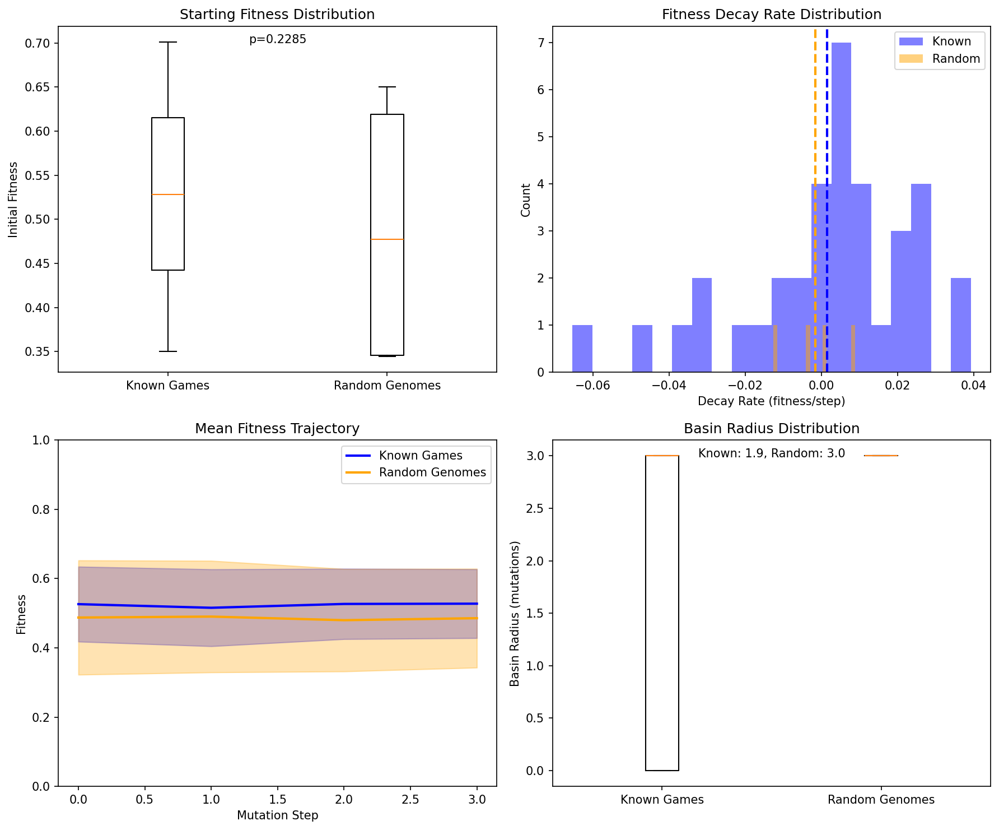
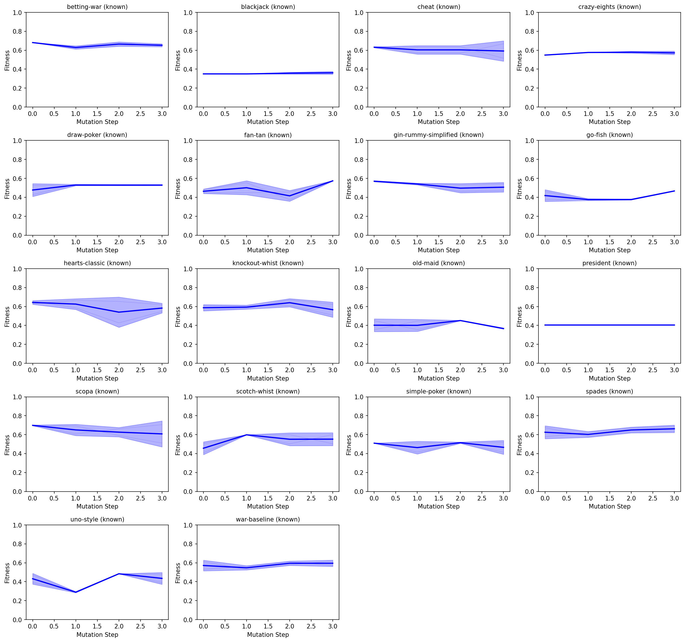
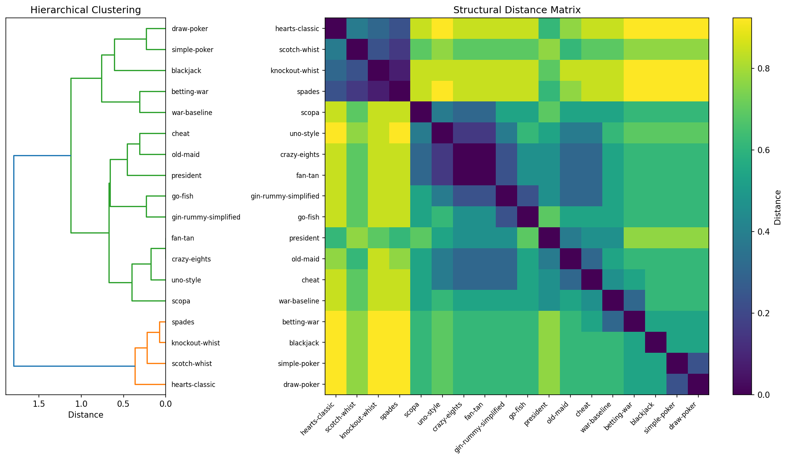
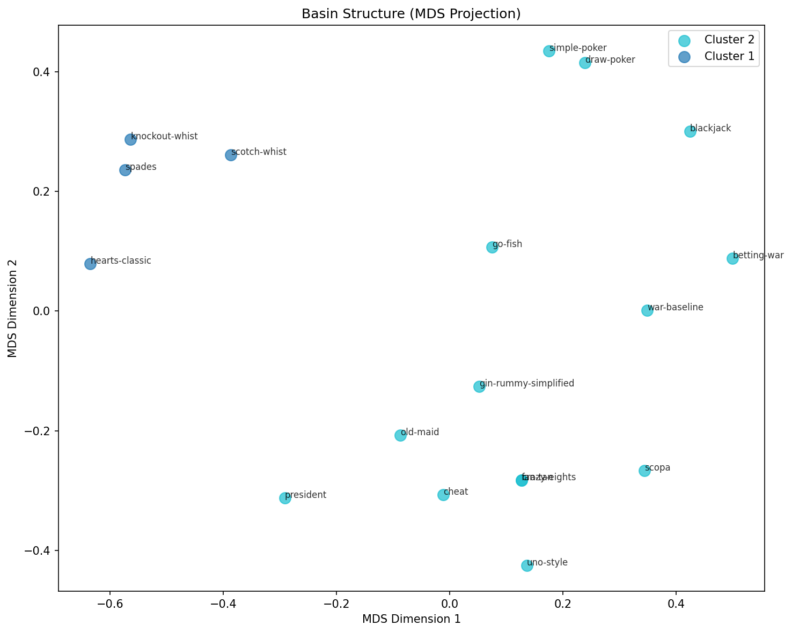

# Basin Analysis Report: Fitness Landscape with Playability Gates

**Date:** 2026-01-15
**Analysis Run:** Updated with playability-gated fitness evaluation
**Config:** 1,000 steps x 250 paths x 50 games/eval
**Samples:** 18 known games (4,500 paths) + 460 random baseline genomes (11,500 paths)

---

## Executive Summary

This analysis investigates the fitness landscape structure using the **playability-enhanced fitness function** that:
- Gates unplayable games to 0 fitness (>50% errors, >95% draws, <1 decision/game, <2 turns)
- Applies graduated playability score as fitness multiplier
- Penalizes low comeback potential, pure luck, and one-sided games

### Key Findings

1. **Strong discrimination achieved** — Known games have 3.4x higher fitness than random genomes
2. **56% of random genomes fail playability** — The gate effectively filters broken games
3. **Known games are robust** — 0% of known game trajectories fall to 0 fitness
4. **Cheat leads the rankings** — High decisions + bluffing mechanics = 0.587 fitness
5. **Two game families persist** — Trick-taking games remain distinct (silhouette = 0.445)

---

## 1. Baseline Comparison: Known vs Random Genomes

### Statistical Summary

| Metric | Known Games | Random Genomes | Ratio |
|--------|-------------|----------------|-------|
| Mean Initial Fitness | **0.479** | 0.142 | **3.4x** |
| Zero Fitness Rate | 0% | 56% | — |
| Fitness Range (95%) | 0.4-0.6 | 0.0-0.4 | — |

### The Playability Gate Works

The fitness function now strongly discriminates between real games and random garbage:

| Fitness Bucket | Known Games | Random Genomes |
|----------------|-------------|----------------|
| 0 (unplayable) | 0% | **56%** |
| 0.0-0.2 | 0% | 7% |
| 0.2-0.4 | 3.6% | 20% |
| 0.4-0.6 | **95.5%** | 17% |
| 0.6-0.8 | 0.9% | 0% |

**Key insight:** Over half of random genomes immediately fail the playability gate, receiving 0 fitness. Known games cluster tightly in the 0.4-0.6 range.



**Figure 1:** Fitness distributions and trajectories comparing known games vs random baseline.

---

## 2. Trajectory Analysis: Mutation Robustness

### Overall Statistics

| Metric | Known Games | Random Baseline |
|--------|-------------|-----------------|
| Initial Fitness | 0.479 | 0.142 |
| Final Fitness | 0.455 | 0.139 |
| Mean Delta | -0.023 | -0.004 |
| Trajectories Ending at 0 | **0%** | **55.9%** |

### Trajectory Outcomes

| Outcome | Known Games | Random Baseline |
|---------|-------------|-----------------|
| Improved (>+0.01) | 640 (14.2%) | 938 (8.2%) |
| Degraded (<-0.01) | 3,057 (67.9%) | 2,507 (21.8%) |
| Stable | 803 (17.8%) | 8,055 (70.0%) |

**Key insight:** Known games degrade gracefully under mutation — they lose fitness but never become unplayable (0% reach 0). Random genomes are mostly stuck at 0 or near-0 fitness.



**Figure 2:** Trajectory plots showing fitness over 1,000 mutation steps.

---

## 3. Per-Game Analysis: Updated Fitness Rankings

With playability-gated fitness, the game rankings are:

| Rank | Game | Initial Fitness | Final Fitness | Delta | Notes |
|------|------|-----------------|---------------|-------|-------|
| 1 | **cheat** | 0.587 | 0.556 | -0.031 | Bluffing + decisions |
| 2 | gin-rummy-simplified | 0.548 | 0.513 | -0.035 | Set collection |
| 3 | betting-war | 0.533 | 0.523 | -0.010 | Betting adds value |
| 4 | president | 0.522 | 0.493 | -0.029 | Shedding + hierarchy |
| 5 | hearts-classic | 0.500 | 0.487 | -0.014 | Trick-taking |
| 6 | spades | 0.496 | 0.475 | -0.021 | Trick-taking |
| 7 | war-baseline | 0.489 | 0.423 | **-0.066** | Highest decay |
| 8 | go-fish | 0.476 | 0.449 | -0.027 | Matching mechanics |
| 9 | fan-tan | 0.474 | 0.459 | -0.015 | Sequence building |
| 10 | scotch-whist | 0.463 | 0.432 | -0.031 | Trick-taking |
| 11 | old-maid | 0.461 | 0.415 | -0.046 | High variance |
| 12 | simple-poker | 0.461 | 0.460 | **-0.001** | Most stable |
| 13 | blackjack | 0.458 | 0.443 | -0.015 | Betting stable |
| 14 | draw-poker | 0.452 | 0.461 | **+0.009** | Improves! |
| 15 | scopa | 0.443 | 0.423 | -0.020 | Capture mechanics |
| 16 | knockout-whist | 0.426 | 0.407 | -0.020 | Trick-taking |
| 17 | crazy-eights | 0.425 | 0.401 | -0.024 | Shedding game |
| 18 | uno-style | 0.398 | 0.378 | -0.021 | Lowest start |

### Notable Patterns

1. **Cheat leads** — High decision density (bluffing) gives it the top spot (0.587)
2. **Poker variants are most stable** — Draw-poker actually improves (+0.009) under mutation
3. **War has highest decay** — -0.066 indicates fragile mechanics despite "known" status
4. **Betting improves stability** — betting-war (0.533) outperforms plain war (0.489)

---

## 4. Clustering Analysis: Game Families

### Cluster Structure

| Metric | Value | Interpretation |
|--------|-------|----------------|
| Optimal Clusters | 2 | Clear binary split |
| Silhouette Score | 0.445 | Moderate separation |

### Cluster Membership

**Cluster 1: Trick-Taking Games**
- Hearts, Spades, Scotch-Whist, Knockout-Whist
- Common: TrickPhase, most_tricks win conditions

**Cluster 2: Everything Else**
- War variants, Poker variants, Shedding games, Matching games
- Diverse mechanics unified by non-trick-taking structure



**Figure 3:** Distance matrix showing trick-taking cluster (dark purple block).



**Figure 4:** MDS projection showing spatial relationships between game types.

---

## 5. Implications for Evolution Strategy

### The Playability Gate Changes Strategy

| Finding | Implication | Strategy |
|---------|-------------|----------|
| 56% random fail playability | Most mutations break games | Conservative mutation early |
| Known games never reach 0 | Starting points are robust | Seed from known games |
| 3.4x fitness gap | Discrimination works | Trust fitness for selection |
| Poker most stable | Betting adds robustness | Favor betting mechanics |

### Recommendations

1. **Seed population with known games** — 3.4x fitness advantage is significant
2. **Moderate mutation rate** — Random genomes easily break; known games are more robust
3. **Selection pressure matters** — Large fitness gap means selection can work effectively
4. **Favor betting/bluffing mechanics** — These add robustness and decision density

---

## 6. Technical Details

### Playability Gate Thresholds

| Check | Threshold | Severity |
|-------|-----------|----------|
| Error rate | >50% | Critical (fitness=0) |
| Draw rate | >95% | Critical (fitness=0) |
| Decisions/game | <1 | Critical (fitness=0) |
| Game length | <2 turns | Critical (fitness=0) |
| Forced move rate | >95% | Major (penalty) |
| One-sided | >80% one player wins | Major (40% penalty) |

### Playability Score Multiplier

The playability score (0-1) acts as a graduated multiplier:
- Score 1.0 → 1.0x (no penalty)
- Score 0.5 → 0.75x (25% penalty)
- Score 0.0 → 0.5x (50% penalty)

### Quality Gates

Additional multiplicative penalties:
- Comeback potential < 0.15 → 50% penalty
- Skill vs luck < 0.15 → 30% penalty
- One-sided (>80%) → 40% penalty

### Configuration

```
Sampling:
  steps_per_path: 1000
  paths_per_genome: 250
  games_per_eval: 50

Baseline:
  random_genomes: 460 (generated)
  trajectories: 11,500 (460 × 25)

Known Games:
  genomes: 18
  trajectories: 4,500 (18 × 250)
```

---

## 7. Conclusions

### Playability Gating is Effective

The updated fitness function achieves strong discrimination:

1. **3.4x fitness ratio** — Known games clearly separated from random
2. **56% rejection rate** — Random genomes fail playability gate
3. **0% known game failures** — Real games never become unplayable under mutation
4. **Graduated pressure** — Playability score creates evolutionary pressure toward robust games

### Strategic Implications

Evolution should operate in **selective exploration mode**:
- Use known games as starting points (3.4x advantage)
- Apply moderate mutation (random easily breaks)
- Trust fitness for selection (discrimination works)
- Favor betting/bluffing mechanics (most stable)

The landscape structure strongly supports evolutionary search starting from known games, with confidence that the fitness function will select for meaningfully playable games.

---

## Appendix: Raw Data

Full analysis data available in `basin_analysis.json` (357 MB) including:
- Complete distance matrix (18×18)
- All 4,500 known game trajectories
- All 11,500 random baseline trajectories
- Cluster assignments and valley depths

---

*Report generated by DarwinDeck Basin Analysis Tool*
*Analysis completed: 2026-01-15*
*Fitness metrics version: Playability-gated (2026-01-15)*
